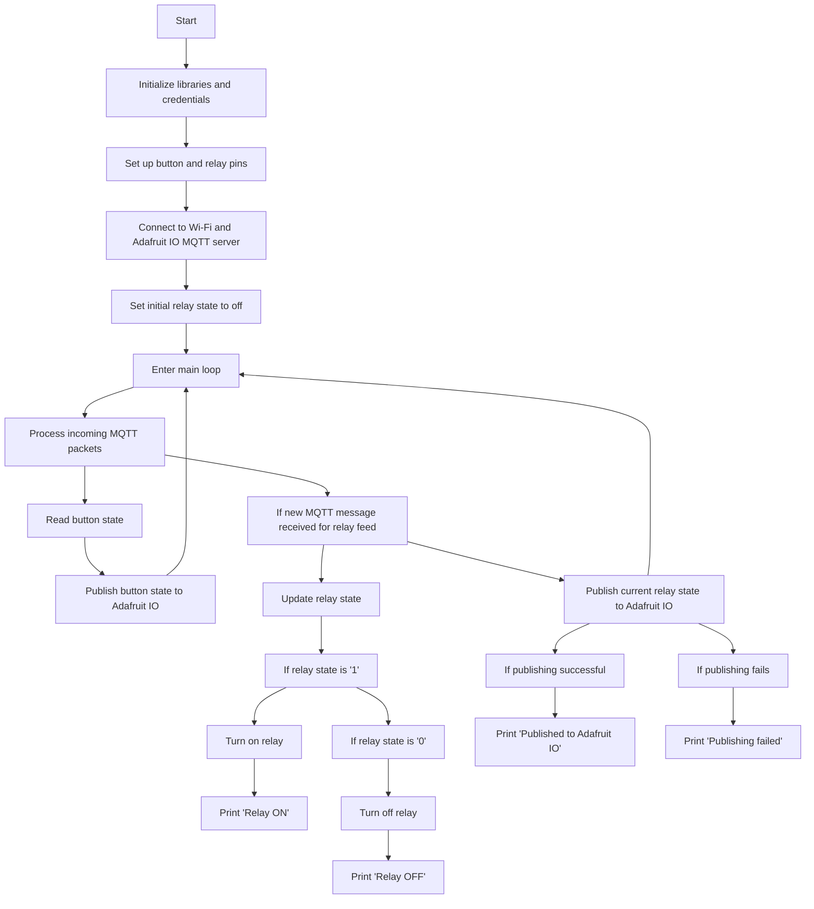

# MQTT Relay Control

This code provides a simple implementation of an MQTT-based relay control system using an ESP8266 board (such as NodeMCU). It connects to the Adafruit IO MQTT server and allows you to control a relay remotely through the Adafruit IO platform or a physical button connected to the board.

## Prerequisites

Before running this code, make sure you have the following:

- An ESP8266-based board (e.g., NodeMCU) with the necessary firmware installed.
- Arduino IDE with the ESP8266 board package installed.
- An Adafruit IO account.
- Wi-Fi network credentials (SSID and password).

## Hardware Setup

Connect the following components to your ESP8266 board:

- Connect a push button to pin D2 (GPIO 2) of the board. This button will be used to control the relay locally.
- Connect a relay module to pin D3 (GPIO 3) of the board. This relay will control the electrical device you want to switch on/off.

## Software Setup

1. Install the necessary libraries:
   - Adafruit MQTT Library: Install it from the Arduino Library Manager (Sketch -> Include Library -> Manage Libraries) by searching for "Adafruit MQTT Library" and clicking "Install".
   - Adafruit MQTT Client Library: Install it from the Arduino Library Manager by searching for "Adafruit MQTT Client" and clicking "Install".
   - ESP8266WiFi Library: Install it from the Arduino Library Manager by searching for "ESP8266WiFi" and clicking "Install".

2. Open the Arduino IDE and create a new sketch.

3. Copy and paste the provided code into the sketch.

4. Update the following constants with your Wi-Fi and Adafruit IO credentials:
   - `ssid`: Set it to your Wi-Fi network SSID.
   - `password`: Set it to your Wi-Fi network password.
   - `AIO_USERNAME`: Set it to your Adafruit IO username.
   - `AIO_KEY`: Set it to your Adafruit IO key.

5. Upload the sketch to your ESP8266 board.

6. Open the serial monitor (Tools -> Serial Monitor) to monitor the board's output.

## Usage

Once the code is uploaded to your ESP8266 board, it will connect to your Wi-Fi network and Adafruit IO MQTT server.

### Remote Control via Adafruit IO

1. Go to the [Adafruit IO](https://io.adafruit.com) website  and log in to your account.

2. Create a new feed called "relay" in your Adafruit IO dashboard.

3. To control the relay remotely, navigate to your "relay" feed and send MQTT messages with the payload `1` to turn the relay on or `0` to turn it off.

### Local Control via Push Button

Press the push button connected to the D2 pin of the ESP8266 board to toggle the state of the relay.

### Monitoring

The serial monitor will display the current status of the relay (ON or OFF) and indicate successful or failed publishing to Adafruit IO.

## Flowchart

## Troubleshooting

- If the ESP8266 fails to connect to your Wi-Fi network, ensure that you have entered the correct SSID and password.
- Check your Adafruit IO credentials (username and key) to ensure they are correct.
- Verify the wiring connections between the ESP8266 board, button, and relay.
- Make sure you have a stable internet connection.

## Note

This code serves as a basic example and may require modifications to suit your specific requirements. Refer to the official documentation of the libraries used for more advanced usage and functionality.

## Credits

This code is based on the Adafruit IO Arduino library examples and modified for this specific relay control application.

- [Adafruit IO Arduino Library](https://github.com/adafruit/Adafruit_IO_Arduino)
- [Adafruit MQTT Library](https://github.com/adafruit/Adafruit_MQTT_Library)
- [ESP8266WiFi Library](https://github.com/esp8266/Arduino)
