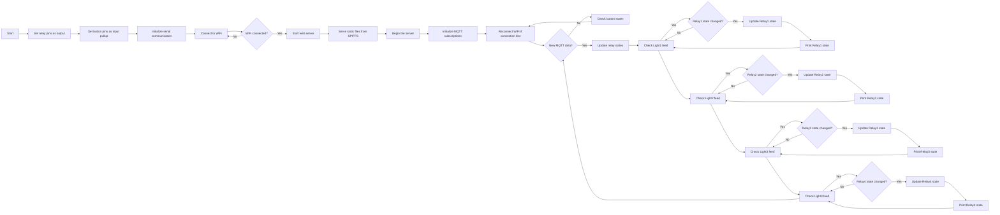

# ESP8266 Smart Relay Control with Push Button, HTML Page, and MQTT

This code is for controlling relays with push buttons, an HTML page, and MQTT on an ESP8266 board.

## Hardware Requirements
- ESP8266 board
- Relays (4)
- Push buttons (4)
- Wires
- Breadboard (optional)

## Software Requirements
- Arduino IDE
- ESP8266 Board Package
- Adafruit MQTT library

## Setup
1. Install the ESP8266 board package and the necessary libraries (ESP8266WiFi, Adafruit_MQTT, and Adafruit_MQTT_Client) in the Arduino IDE.
2. Replace the placeholder values in the code with your own WiFi SSID and password, MQTT server, username, and key.
3. Assign the correct digital pins for the relays and push buttons in the code.
4. Upload the code to your ESP8266 board.
5. Connect the board to a power source and make sure it is connected to the same network as your MQTT server.

## Introduction
This is the code for controlling 4 relays and a reset button using an ESP8266 microcontroller and the Adafruit IO platform. The relays can be controlled through buttons, a web server, and the Adafruit IO dashboard. The code sets up a web server to receive HTTP requests and establishes an MQTT connection to Adafruit IO to receive and publish data.

## Pin Configuration
The following pins are defined in the code:

- Relay1: D0
- Relay2: D1
- Relay3: D2
- Relay4: D3
- Relay1_Button: D7
- Relay2_Button: D6
- Relay3_Button: D5
- Relay4_Button: D4

## Flowchart 



## WiFi and Adafruit IO Configuration
WiFi credentials must be provided in the following lines:

```
#define WLAN_SSID "your-ap" // Your SSID
#define WLAN_PASS "ap_pass" // Your password
```

Adafruit IO credentials must be provided in the following lines:

```
#define AIO_SERVER "io.adafruit.com"
#define AIO_SERVERPORT 1883 // use 8883 for SSL
#define AIO_USERNAME "aio_username"
#define AIO_KEY "aio_key"
```


## Functionality
The code sets up a web server to serve an HTML page that allows the user to toggle the state of the relays. It also establishes an MQTT connection to Adafruit IO and subscribes to 4 feeds for the relays. The state of the relays can be controlled through the web page or the Adafruit IO dashboard.

## Dependencies
The following libraries are used in the code and must be installed:

- ESP8266WiFi
- Adafruit_MQTT
- Adafruit_MQTT_Client
- ESPAsyncWebServer

## Usage
1. Connect the relays and push buttons to the specified digital pins on the ESP8266 board.
2. Configure the WiFi and Adafruit IO credentials in the code.
3. Upload the code to the ESP8266 board.
4. Power up the board and ensure it is connected to the same network as your MQTT server.
5. Access the web page hosted by the ESP8266 board to control the relays.
6. Optionally, use the Adafruit IO dashboard to control the relays remotely.

## Conclusion
This code provides a simple solution for controlling relays through push buttons, an HTML page, and the Adafruit IO platform. It can be modified for different applications and further developed to meet specific requirements.
