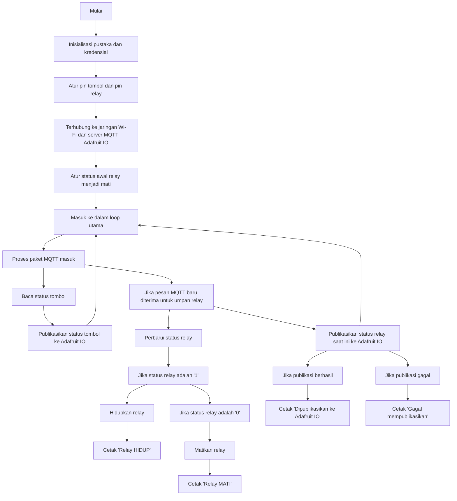

# Kendali relay Berbasis MQTT

Kode ini menyediakan implementasi sederhana dari sistem kendali relay berbasis MQTT menggunakan papan ESP8266 (seperti NodeMCU). Kode ini terhubung ke server MQTT Adafruit IO dan memungkinkan Anda mengendalikan sebuah relay secara remote melalui platform Adafruit IO atau menggunakan tombol fisik yang terhubung ke papan.

## Persyaratan

Sebelum menjalankan kode ini, pastikan Anda memiliki hal-hal berikut:

- Papan berbasis ESP8266 (misalnya NodeMCU) dengan firmware yang diperlukan terpasang.
- Arduino IDE dengan paket papan ESP8266 terpasang.
- Akun Adafruit IO.
- Kredensial jaringan Wi-Fi (SSID dan kata sandi).

## Penyiapan Perangkat

Hubungkan komponen-komponen berikut ke papan ESP8266 Anda:

- Hubungkan tombol tekan ke pin D2 (GPIO 2) dari papan. Tombol ini akan digunakan untuk mengendalikan relay secara lokal.
- Hubungkan modul relay ke pin D3 (GPIO 3) dari papan. relay ini akan mengendalikan perangkat listrik yang ingin Anda hidupkan/matikan.

## Penyiapan Perangkat Lunak

1. Pasang pustaka-pustaka yang diperlukan:
   - Pustaka MQTT Adafruit: Pasang dari Manajer Pustaka Arduino (Sketch -> Include Library -> Manage Libraries) dengan mencari "Adafruit MQTT Library" dan mengklik "Install".
   - Pustaka Klien MQTT Adafruit: Pasang dari Manajer Pustaka Arduino dengan mencari "Adafruit MQTT Client" dan mengklik "Install".
   - Pustaka ESP8266WiFi: Pasang dari Manajer Pustaka Arduino dengan mencari "ESP8266WiFi" dan mengklik "Install".

2. Buka Arduino IDE dan buatlah sebuah sketsa baru.

3. Salin dan tempelkan kode yang disediakan ke dalam sketsa.

4. Perbarui konstanta-konstanta berikut dengan kredensial Wi-Fi dan Adafruit IO Anda:
   - `ssid`: Atur dengan SSID jaringan Wi-Fi Anda.
   - `password`: Atur dengan kata sandi jaringan Wi-Fi Anda.
   - `AIO_USERNAME`: Atur dengan nama pengguna Adafruit IO Anda.
   - `AIO_KEY`: Atur dengan kunci Adafruit IO Anda.

5. Unggah sketsa ke papan ESP8266 Anda.

6. Buka monitor serial (Tools -> Serial Monitor) untuk memantau keluaran papan.

## Penggunaan

Setelah kode diunggah ke papan ESP8266 Anda, papan akan terhubung ke jaringan Wi-Fi Anda dan server MQTT Adafruit IO.

### Kendali Jarak Jauh melalui Adafruit IO

1. Buka situs web [Adafruit IO](https://io.adafruit.com) dan masuk ke akun Anda.

2. Buat umpan baru bernama "relay" di dasbor Adafruit IO Anda.

3. Untuk mengendalikan relay secara jarak jauh, buka umpan "relay" Anda dan kirim pesan MQTT dengan muatan `1` untuk menghidupkan relay atau `0` untuk mematikannya.

### Kendali Lokal melalui Tombol Tekan

Tekan

 tombol tekan yang terhubung ke pin D2 dari papan ESP8266 untuk mengubah status relay.

### Pemantauan

Monitor serial akan menampilkan status terkini dari relay (HIDUP atau MATI) dan menunjukkan berhasil atau gagalnya pengiriman ke Adafruit IO.

## Diagram Alir

## Menangani Masalah

- Jika ESP8266 gagal terhubung ke jaringan Wi-Fi Anda, pastikan bahwa Anda telah memasukkan SSID dan kata sandi yang benar.
- Periksa kredensial Adafruit IO Anda (nama pengguna dan kunci) untuk memastikan bahwa mereka benar.
- Verifikasi koneksi kabel antara papan ESP8266, tombol, dan relay.
- Pastikan Anda memiliki koneksi internet yang stabil.

## Catatan

Kode ini hanya merupakan contoh dasar dan mungkin memerlukan modifikasi sesuai dengan kebutuhan spesifik Anda. Rujuk dokumentasi resmi dari pustaka-pustaka yang digunakan untuk penggunaan dan fungsionalitas yang lebih canggih.

## Kredit

Kode ini didasarkan pada contoh-contoh pustaka Arduino Adafruit IO dan dimodifikasi untuk aplikasi kendali relay tertentu ini.

- [Pustaka Arduino Adafruit IO](https://github.com/adafruit/Adafruit_IO_Arduino)
- [Pustaka MQTT Adafruit](https://github.com/adafruit/Adafruit_MQTT_Library)
- [Pustaka ESP8266WiFi](https://github.com/esp8266/Arduino)
