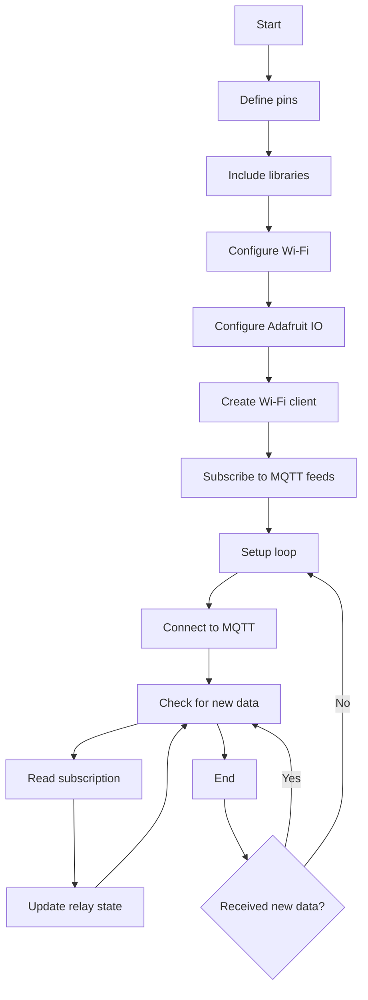

# Code Readme

This README file provides an overview and explanation of the code provided. The code is written for an ESP8266-based device that connects to a Wi-Fi network and communicates with the Adafruit IO MQTT server to control four relays.

## Functionality

The code allows you to control four relays connected to the ESP8266 device through the Adafruit IO MQTT service. Each relay can be controlled by publishing messages to the corresponding MQTT feed.

## Setup

To use this code, follow these steps:

1. Make sure you have the necessary libraries installed. This code requires the "ESP8266WiFi," "Adafruit_MQTT," and "Adafruit_MQTT_Client" libraries.

2. Define the necessary constants at the beginning of the code:
   - `Relay1`, `Relay2`, `Relay3`, `Relay4`: The pins to which the relays are connected.
   - `WLAN_SSID` and `WLAN_PASS`: Your Wi-Fi network SSID and password.
   - `AIO_SERVER` and `AIO_SERVERPORT`: The Adafruit IO MQTT server and port.
   - `AIO_USERNAME` and `AIO_KEY`: Your Adafruit IO username and key.

3. Connect the relays to the ESP8266 device. Make sure the relays are connected to the correct pins as defined in the code.

4. Upload the code to your ESP8266 device.

5. The device will attempt to connect to the specified Wi-Fi network. Once connected, it will subscribe to the MQTT feeds defined in `Light1`, `Light2`, `Light3`, and `Light4`.

6. Control the relays by publishing messages to the corresponding MQTT feeds on the Adafruit IO platform.

## Usage

Once the code is set up and running on the ESP8266 device, you can control the relays using the Adafruit IO MQTT platform. Publish messages to the following MQTT feeds:

- `AIO_USERNAME/feeds/relay1`: Control the state of Relay 1.
- `AIO_USERNAME/feeds/relay2`: Control the state of Relay 2.
- `AIO_USERNAME/feeds/relay3`: Control the state of Relay 3.
- `AIO_USERNAME/feeds/relay4`: Control the state of Relay 4.

To control a relay, publish a message with the desired state to the corresponding MQTT feed. The state can be either `0` or `1`, where `0` represents the relay being off and `1` represents the relay being on.

## Flowchart

## Notes

- The code continuously checks for new data from the MQTT server in the `loop()` function. It reads any incoming messages from the subscribed MQTT feeds and updates the state of the corresponding relays accordingly.

- Make sure to replace the placeholder values (e.g., `WLAN_SSID`, `WLAN_PASS`, `AIO_USERNAME`, `AIO_KEY`) with your actual Wi-Fi and Adafruit IO credentials.

- Adjust the `20000` value in the `mqtt.readSubscription()` function call if you want to change the timeout for checking new data from the MQTT server.

- Ensure that you have an active Wi-Fi connection and that your ESP8266 device can reach the Adafruit IO MQTT server.

- For more information on using the Adafruit IO MQTT service, refer to the Adafruit IO documentation.

Please feel free to modify the code as per your requirements and add any necessary error handling or additional functionality.
